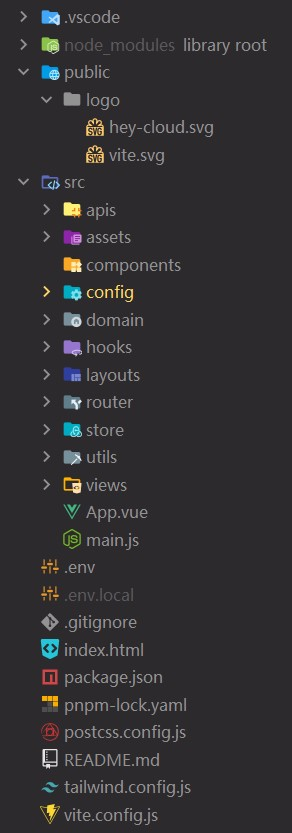

# 简介

这是一款简单的web云盘项目

# 前端

## 项目结构

技术栈：vue3、vite、vue-router、pinia、tdesign、taliwindcss

结构分析：
1. api 存放axios请求
2. assets 静态文件
3. components 常用组件
4. config 全局设置
5. domain 领域层，存放常量与实体类、枚举类等
6. hooks 常用钩子函数
7. layouts 布局
8. router 全局路由与路由拦截
9. store 基于pinia提供的持久化存储
10. utils 工具类
11. views 界面

 

## 目前展示

登录与注册界面

云盘首页

 

# 后端

## 项目结构

技术栈：Springboot、Sa-Token、Redis、MySQL、Mybatis-plus、poi、Minio、Okhttp

项目结构分析：
1. application 应用层；程序入口点，Springbootentrypoint
2. basic 基础层；工具类等常用方法函数
3. common 模块层；如minio、so-token登录鉴权模块
4. domain 领域层；设置实体类及其对应聚合对象，并提供DTO、VO数据类型与对应转换方法
5. infrastructure 基础设施层；实现mapper与service，解耦

 

# 中间件

## file-operator-start

文件操作中间件

整合以下功能：
1. 本地存储，不依赖框架
2. minio
3. 七牛云对象存储
